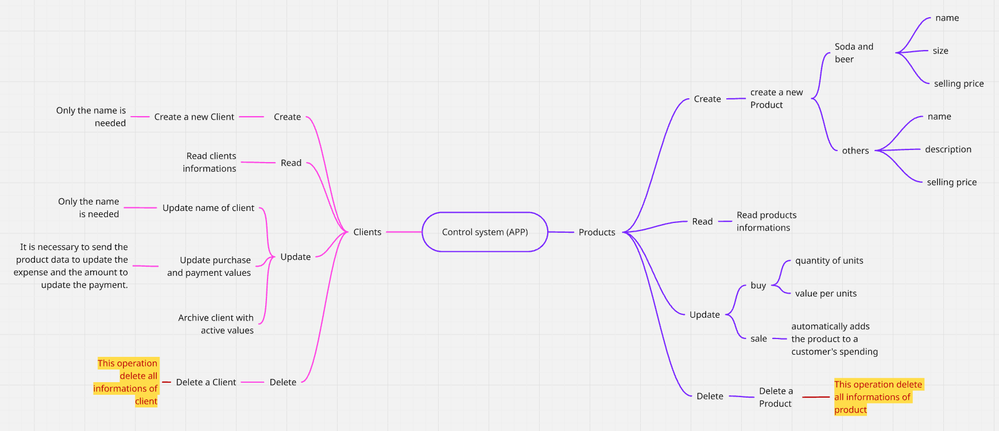

<p align="center">
  
</p>

# Bar da Su

Aplicativo de controle de estoque e gerenciamento de clientes, desenvolvido em **React Native com Expo**.

## 📱 Funcionalidades

- Cadastro, edição e remoção de clientes
- Cadastro de produtos com categorias
- Controle de estoque e movimentações
- Arquivamento de clientes
- Interface intuitiva com navegação via Tabs e Stack

## 🚀 Tecnologias utilizadas

- [Expo](https://expo.dev/)
- [React Native](https://reactnative.dev/)
- [React Navigation](https://reactnavigation.org/)
- [DropDownPicker](https://github.com/hossein-zare/react-native-dropdown-picker)
- [JavaScript]

## 🛠️ Estrutura de pastas

```bash
src/
├── components/         # Componentes reutilizáveis (botões, inputs, etc)
├── models/             # Modelos de dados (clientes e produtos)
├── viewModels/         # Lógica MVVM 
├── navigations/        # Stack e Tabs Navigation
├── views/              # Telas principais
├── services/           # Serviços de manipulaçao e armazenamento local de dados
└── theme/              # temas default do projeto
```

##  Mapa mental

